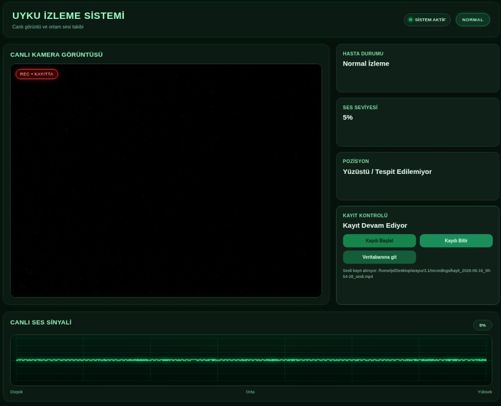
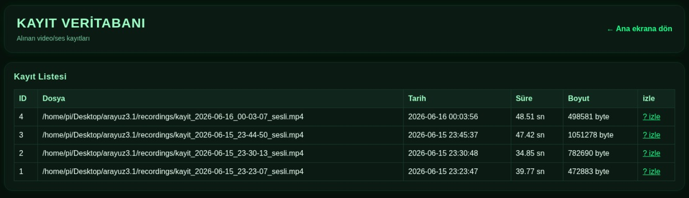
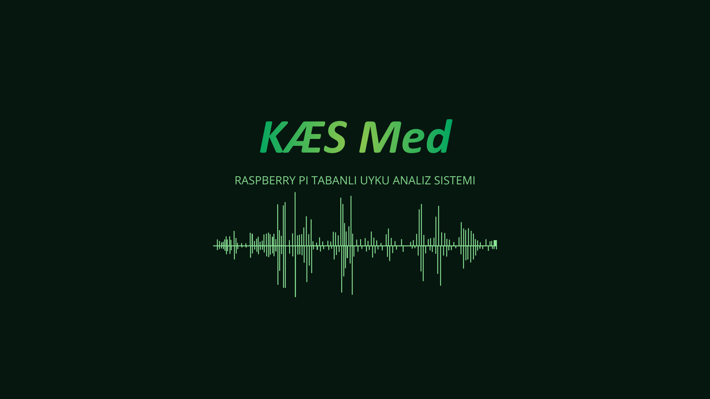

# 🛌 Raspberry pi — Sleep Monitoring System

A real-time sleep monitoring system built on Raspberry Pi 3B+, developed as a university course project (BME22354) at Fatih Sultan Mehmet Vakıf University Supervised by **Dr. Mahmud Esad Arar**.

The system combines real-time video monitoring, synchronized audio-video, a web-based dashboard, and SQLite database integration to provide a platform for sleep observation and data collection.

---

## 📸 Demo

### Live Dashboard

### Recording Database

---

## ⚙️ System Architecture
Raspberry Pi 3B+:

    -PiCamera2          → Live video stream (320x240)

    -USB Microphone     → Real-time audio capture

    -OpenCV (Haar Cascade) → Head position detection

    -FFmpeg             → Audio-video merge → .mp4

    -SQLite             → Recording metadata storage

    -Flask              → Web interface (port 5000)

---

## 🔍 Features

- **Live video stream** via Flask MJPEG feed
- **Head position detection** — Supine / Left / Right / Prone using frontal + profile Haar Cascades
- **Real-time audio waveform** visualization with sound level monitoring
- **Synchronized recording** — separate video (.avi) and audio (.wav) merged into .mp4 via FFmpeg
- **SQLite database** — stores filename, timestamp, duration, and file size for every session
- **Web interface** — accessible from any device on the local network

---

# 🛠 Tech Stack

| Layer | Technology |
|-------|-----------|
| Hardware | Raspberry Pi 3B+, PiCamera2, USB Microphone |
| Computer Vision | OpenCV, Haar Cascade Classifier |
| Audio | sounddevice, wave, FFmpeg |
| Database | SQLite3 |
| Frontend | HTML, CSS, JavaScript |
| Backend | Python, Flask |

---

📂 Repository Structure;
    -app.py
    -templates:
        -index.html
        -database.html
    -static:
        style.css
    -images:
        -dashboard.jpeg
        -database_page.jpeg
        -project_block_diagram.png
    demo:
        -sleep_monitoring_demo.mp4

---
## 👥 Team

**KÆS Med** — BME22354 Course Project

  

-Sıdra Öztürk
-Kevser Kalaman
-Ahmet Eren Söner

Supervised by **Dr. Mahmud Esad Arar**

---

## 📄 License

This project was developed for academic purposes at Fatih Sultan Mehmet Vakıf University, 2026.